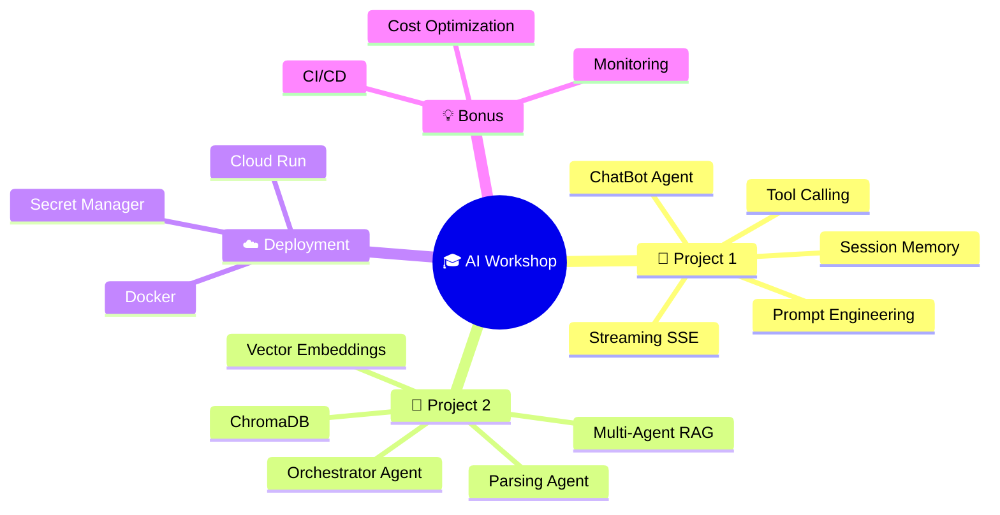
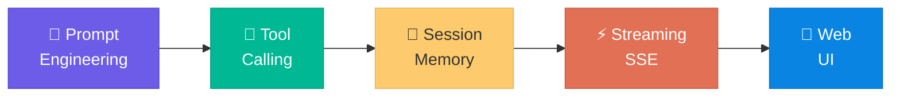
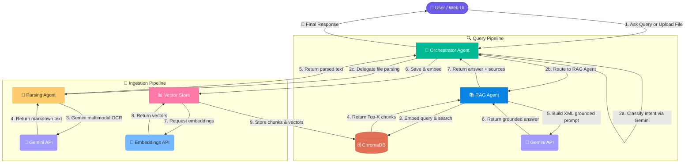

<div align="center">

# 🤖 AI Workshop

### *From Zero to Production-Ready AI Applications*

[](https://python.org)
[](https://fastapi.tiangolo.com)
[](https://ai.google.dev)
[](https://www.trychroma.com)
[](https://docker.com)
[](LICENSE)

<br>


<br>

**A hands-on, two-project workshop covering AI chatbots, multi-agent systems, RAG pipelines, prompt engineering, and cloud deployment — all built with production-grade architecture.**

[🚀 Quick Start](#-quick-start) · [📦 Project 1: ChatBot](#-project-1--chatbot-agent) · [🧠 Project 2: Multi-Agent RAG](#-project-2--multi-agent-rag-assistant) · [☁️ Deployment](#%EF%B8%8F-deployment) · [📚 Workshop Modules](#-workshop-modules)

---

</div>

## 🗺️ Workshop at a Glance



---

## ✨ Highlights

<table>
<tr>
<td width="50%">

### 🏗️ Production Architecture
- SOLID & DRY principles throughout
- Pydantic schemas for type safety
- Modular service layers
- Environment-based configuration

</td>
<td width="50%">

### 🧪 Hands-On Learning
- Copy-paste ready code snippets
- Step-by-step build instructions
- Interactive Web UI included
- Swagger API docs auto-generated

</td>
</tr>
<tr>
<td width="50%">

### 🔧 Real-World Tools
- Google Gemini 3.1 SDK
- ChromaDB vector database
- Server-Sent Events streaming
- Docker containerization

</td>
<td width="50%">

### 🚀 Deploy Anywhere
- Local development server
- Docker container builds
- Google Cloud Run
- Secret Manager integration

</td>
</tr>
</table>

---

## 📦 Repository Structure

```
clg-ai-workshop/
│
├── 📁 chatbot_agent/              ← Project 1: AI ChatBot Agent
│   ├── app/
│   │   ├── main.py                # FastAPI app setup & health check
│   │   ├── config.py              # Pydantic BaseSettings (.env reader)
│   │   ├── schemas/chat.py        # Request/Response models
│   │   ├── prompts/
│   │   │   ├── system_prompts.py  # 4 prompt engineering techniques
│   │   │   └── campus_faqs.py     # Knowledge base dataset
│   │   ├── tools/campus_tools.py  # DateTime, Calculator, FAQ Lookup
│   │   ├── services/
│   │   │   ├── memory_service.py  # Sliding-window session manager
│   │   │   └── agent_service.py   # Gemini SDK orchestration
│   │   └── api/chat_router.py     # REST API endpoints
│   ├── static/                    # Glassmorphic Web UI
│   ├── Dockerfile
│   ├── requirements.txt
│   └── README.md
│
├── 📁 multi_agent_rag/            ← Project 2: Multi-Agent RAG
│   ├── app/
│   │   ├── main.py                # FastAPI app with lifespan events
│   │   ├── config.py              # Centralized configuration
│   │   ├── genai_client.py        # Shared GenAI client (DRY)
│   │   ├── prompts/
│   │   │   ├── routing_prompt.py  # Intent classification
│   │   │   ├── chat_prompt.py     # Casual conversation handler
│   │   │   └── rag_prompt.py      # XML grounded answer generation
│   │   ├── schemas/rag.py         # Pydantic schemas
│   │   ├── services/
│   │   │   ├── orchestrator_agent.py    # Central coordinator
│   │   │   ├── parsing_agent.py         # PDF/Image text extraction
│   │   │   ├── rag_service.py           # Retrieve → Augment → Generate
│   │   │   └── vector_store_service.py  # ChromaDB operations
│   │   └── api/rag_router.py      # REST endpoints
│   ├── sample_docs/               # Seed policy documents
│   ├── static/                    # Web UI
│   ├── Dockerfile
│   ├── requirements.txt
│   └── README.md
│
└── Closing.md                     # Deployment & bonus topics
```

---

## 🚀 Quick Start

### Prerequisites

| Tool | Version | Purpose |
|------|---------|---------|
| 🐍 Python | 3.10+ | Runtime |
| 🔑 Google AI Studio | — | [Get your Gemini API Key](https://aistudio.google.com/apikey) |
| 🐳 Docker | Latest | *(Optional)* Containerization |
| ☁️ Google Cloud SDK | Latest | *(Optional)* Cloud Run deployment |

---

<details>
<summary><h3>⚡ Project 1 — ChatBot Agent Setup</h3></summary>

<br>

**1️⃣ Clone & Navigate**
```bash
git clone https://github.com/vaishnaviwangalwar-cpu/clg-ai-workshop.git
cd clg-ai-workshop/chatbot_agent
```

**2️⃣ Create Virtual Environment**
```bash
python -m venv venv

# macOS/Linux
source venv/bin/activate

# Windows
venv\Scripts\activate
```

**3️⃣ Install Dependencies**
```bash
pip install -r requirements.txt
```

**4️⃣ Configure Environment**
```bash
cp .env.example .env
```

Edit `.env` with your credentials:
```env
GEMINI_API_KEY=your_google_ai_studio_api_key_here
GEMINI_MODEL=gemini-3.1-flash-lite
APP_ENV=development
HOST=0.0.0.0
PORT=8000
MAX_SESSION_TURNS=10
```

**5️⃣ Launch!**
```bash
uvicorn app.main:app --reload --port 8000
```

| Endpoint | URL |
|----------|-----|
| 🌐 Web UI | [http://localhost:8000](http://localhost:8000) |
| 📖 Swagger Docs | [http://localhost:8000/docs](http://localhost:8000/docs) |
| 💚 Health Check | [http://localhost:8000/health](http://localhost:8000/health) |

</details>

---

<details>
<summary><h3>⚡ Project 2 — Multi-Agent RAG Setup</h3></summary>

<br>

**1️⃣ Navigate to Project**
```bash
cd clg-ai-workshop/multi_agent_rag
```

**2️⃣ Create Virtual Environment**
```bash
python -m venv venv

# macOS/Linux
source venv/bin/activate

# Windows
venv\Scripts\activate
```

**3️⃣ Install Dependencies**
```bash
pip install -r requirements.txt
```

**4️⃣ Configure Environment**
```bash
cp .env.example .env
```

Edit `.env` with your credentials:
```env
GEMINI_API_KEY=your_google_ai_studio_api_key_here
GEMINI_MODEL=gemini-3.1-flash-lite
EMBEDDING_MODEL=gemini-embedding-001
CHROMA_PATH=./chroma_db
TOP_K=3
```

**5️⃣ Launch!**
```bash
uvicorn app.main:app --reload --port 8001
```

| Endpoint | URL |
|----------|-----|
| 🌐 Web UI | [http://localhost:8001](http://localhost:8001) |
| 📖 Swagger Docs | [http://localhost:8001/docs](http://localhost:8001/docs) |
| 💚 Health Check | [http://localhost:8001/health](http://localhost:8001/health) |

</details>

---

## 📦 Project 1 — ChatBot Agent

<div align="center">

*A production-grade AI ChatBot with prompt engineering, tool calling, session memory, and streaming responses.*

</div>

### 🎯 What You'll Learn



<details>
<summary><b>📝 Module 3 — Prompt Engineering Techniques</b></summary>

<br>

The chatbot implements **4 distinct prompt engineering strategies** that you can switch between at runtime:

| # | Technique | Description | Best For |
|---|-----------|-------------|----------|
| 1 | **Standard Baseline** | Minimal system prompt | Simple Q&A |
| 2 | **Structured XML Tags** | XML-formatted instruction blocks | Precision & control |
| 3 | **Few-Shot Examples** | Input/output demonstration pairs | Consistent formatting |
| 4 | **Chain-of-Thought** | Step-by-step reasoning guidance | Complex problem solving |

> 💡 **Try it**: Switch between prompt strategies in the Web UI dropdown to see how each one changes the model's behavior and response quality!

</details>

<details>
<summary><b>🔧 Tool Calling (Function Calling)</b></summary>

<br>

The chatbot agent is equipped with **3 built-in tools** that Gemini can invoke automatically:

| Tool | Function | Example Query |
|------|----------|---------------|
| 🕐 `get_current_datetime` | Returns current date & time | *"What time is it?"* |
| 🧮 `calculate` | Safe mathematical expression evaluator (AST-based) | *"What's 15% of 2400?"* |
| 📋 `lookup_faq` | Searches campus knowledge base | *"What's the library timing?"* |

```
User: "What's 25 * 48 + 300?"
├── 🤖 Gemini detects math intent
├── 🔧 Calls calculate("25 * 48 + 300")
├── 📊 Tool returns: 1500
└── 💬 Agent: "The result of 25 × 48 + 300 is **1,500**"
```

</details>

<details>
<summary><b>🧠 Session Memory Management</b></summary>

<br>

Conversation context is managed via an **in-memory sliding window**:

```
┌─────────────────────────────────────────┐
│         Session Memory (MAX_TURNS=10)    │
├─────────────────────────────────────────┤
│  Turn 1: User → "Hi!"                  │  ← Oldest
│  Turn 2: Bot  → "Hello! How can I..."  │
│  Turn 3: User → "Tell me about..."     │
│  ...                                    │
│  Turn 10: Bot → "Here's what I found"  │  ← Newest
├─────────────────────────────────────────┤
│  Turn 11 arrives → Turn 1 evicted 🗑️   │
└─────────────────────────────────────────┘
```

- **No database required** — pure in-memory sliding window
- **Caps token usage** — prevents context window overflow
- **Session isolation** — each session ID maintains its own history

</details>

<details>
<summary><b>⚡ Dual Response Modes</b></summary>

<br>

| Mode | Endpoint | Transport | Use Case |
|------|----------|-----------|----------|
| **Standard** | `POST /api/chat` | JSON response | Simple integrations |
| **Streaming** | `POST /api/chat/stream` | Server-Sent Events (SSE) | Real-time UI updates |

Both modes share the **same session memory** — switching modes mid-conversation preserves full context.

</details>

---

## 🧠 Project 2 — Multi-Agent RAG Assistant

<div align="center">

*A multi-agent Retrieval-Augmented Generation system with document ingestion, vector search, and grounded answers.*

</div>

### 🏗️ Architecture & Data Flow



### 🎯 What You'll Learn

<details>
<summary><b>🎯 Multi-Agent Coordination</b></summary>

<br>

The system uses a **central orchestrator pattern** where every request flows through a coordinator agent:

```
User Query → Orchestrator Agent
                ├── Intent: "policy_question" → RAG Agent → Grounded Answer
                ├── Intent: "casual_chat" → Direct LLM Response
                └── Intent: "file_upload" → Parsing Agent → Vector Store
```

The Orchestrator uses Gemini to **classify intent** before routing, ensuring each specialist agent only handles what it's designed for.

</details>

<details>
<summary><b>📄 Multimodal Document Ingestion</b></summary>

<br>

The Parsing Agent supports **3 document formats** — no local parsing libraries needed:

| Format | Method | How It Works |
|--------|--------|-------------|
| 📄 `.txt` | Direct read | Plain text extraction |
| 📕 `.pdf` | Gemini Vision | Multimodal LLM reads pages as images |
| 🖼️ Images | Gemini Vision | OCR via `gemini-3.1-flash-lite` |

> 🔥 **Key Insight**: Instead of using traditional PDF parsers like `PyPDF2` or `pdfplumber`, this project leverages **Gemini's multimodal capabilities** to extract layout-aware text directly from document images!

</details>

<details>
<summary><b>🔢 Vector Embeddings & Search</b></summary>

<br>

```
Document → Chunk (paragraphs) → Embed (gemini-embedding-001) → Store (ChromaDB)
                                                                      ↓
User Query → Embed → Cosine Similarity Search → Top-K Chunks → Grounded Answer
```

| Component | Technology | Purpose |
|-----------|------------|---------|
| Embeddings | `gemini-embedding-001` | Convert text to high-dimensional vectors |
| Vector DB | ChromaDB (persistent) | Store & query vectors by similarity |
| Retrieval | Cosine similarity | Find most relevant document chunks |
| Top-K | Configurable (default: 3) | Number of chunks to retrieve |

</details>

<details>
<summary><b>🛡️ Grounded Answer Generation</b></summary>

<br>

Retrieved chunks are injected into a **strict XML prompt template** that enforces grounding rules:

```xml
<context>
  <document source="policy.txt" chunk="3">
    Students must maintain a minimum 75% attendance...
  </document>
</context>

<rules>
  - ONLY answer based on the provided context
  - If the context doesn't contain the answer, say so clearly
  - Cite the source document for every claim
</rules>
```

> 🛡️ This structured grounding approach **prevents hallucination** by constraining the model to only use information present in the retrieved documents.

</details>

---

## 📚 Workshop Modules

<div align="center">

| Module | Topic | Project | Key Concepts |
|:------:|-------|---------|-------------|
| **1** | 🏗️ Architecture & Setup | Both | SOLID principles, project scaffolding, virtual environments |
| **2** | 🔌 Google GenAI SDK | Both | API keys, model configuration, SDK initialization |
| **3** | 📝 Prompt Engineering | ChatBot | XML tags, few-shot, chain-of-thought, baseline comparison |
| **4** | 🧠 Memory & Sessions | ChatBot | Sliding window context, session isolation, token management |
| **5** | 🔧 Tool / Function Calling | ChatBot | Python tool definitions, automatic invocation, result formatting |
| **6** | ⚡ Streaming (SSE) | ChatBot | Server-Sent Events, real-time token delivery, dual modes |
| **7** | 📄 Document Parsing | Multi-Agent RAG | Multimodal PDF/image extraction via Gemini Vision |
| **8** | 🔢 Embeddings & Vectors | Multi-Agent RAG | `gemini-embedding-001`, chunking strategies, ChromaDB |
| **9** | 🎯 Multi-Agent Orchestration | Multi-Agent RAG | Intent classification, agent routing, specialist coordination |
| **10** | 🛡️ RAG Pipeline | Multi-Agent RAG | Retrieve → Augment → Generate, grounding, source citation |
| **11** | ☁️ Deployment | Both | Docker, Cloud Run, Secret Manager, public URLs |

</div>

---

## ☁️ Deployment

<details>
<summary><b>🐳 Docker Build & Run</b></summary>

<br>

**ChatBot Agent:**
```bash
cd chatbot_agent
docker build -t chatbot-agent .
docker run -p 8000:8000 --env-file .env chatbot-agent
```

**Multi-Agent RAG:**
```bash
cd multi_agent_rag
docker build -t multi-agent-rag .
docker run -p 8001:8001 --env-file .env multi-agent-rag
```

</details>

<details>
<summary><b>☁️ Google Cloud Run Deployment</b></summary>

<br>

**1. Authenticate & Set Project**
```bash
gcloud auth login
gcloud config set project YOUR_PROJECT_ID
```

**2. Store API Key in Secret Manager**
```bash
echo -n "YOUR_GEMINI_API_KEY" | \
  gcloud secrets create gemini-api-key --data-file=-
```

**3. Push to Artifact Registry**
```bash
gcloud builds submit --tag gcr.io/YOUR_PROJECT_ID/chatbot-agent
```

**4. Deploy to Cloud Run**
```bash
gcloud run deploy chatbot-agent \
  --image gcr.io/YOUR_PROJECT_ID/chatbot-agent \
  --platform managed \
  --region us-central1 \
  --allow-unauthenticated \
  --set-secrets="GEMINI_API_KEY=gemini-api-key:latest"
```

> 📖 See detailed deployment guides: [`chatbot_agent/DEPLOYMENT.md`](chatbot_agent/DEPLOYMENT.md) | [`multi_agent_rag/DEPLOYMENT.md`](multi_agent_rag/DEPLOYMENT.md)

</details>

---

## 🛠️ Tech Stack

<div align="center">

| Layer | Technology | Role |
|-------|-----------|------|
| 🌐 **Backend** | FastAPI | Async REST API framework |
| 🤖 **AI/LLM** | Google Gemini 3.1 (`google-genai`) | Language model & multimodal AI |
| 🔢 **Embeddings** | `gemini-embedding-001` | Text-to-vector conversion |
| 🗄️ **Vector DB** | ChromaDB | Persistent vector storage & search |
| ✅ **Validation** | Pydantic v2 | Schema validation & settings management |
| 🎨 **Frontend** | HTML5 / CSS3 / JavaScript | Glassmorphic interactive Web UI |
| 🐳 **Container** | Docker | Production containerization |
| ☁️ **Cloud** | Google Cloud Run | Serverless container hosting |
| 🔐 **Secrets** | GCP Secret Manager | Secure credential management |

</div>

---

## 🔌 API Reference

<details>
<summary><b>ChatBot Agent Endpoints</b></summary>

<br>

| Method | Endpoint | Description |
|--------|----------|-------------|
| `POST` | `/api/chat` | Send a message, get a response |
| `POST` | `/api/chat/stream` | Send a message, get streaming SSE response |
| `GET` | `/api/sessions` | List all active sessions |
| `GET` | `/api/prompts` | List available prompt strategies |
| `GET` | `/health` | Health check |

**Example Request:**
```bash
curl -X POST http://localhost:8000/api/chat \
  -H "Content-Type: application/json" \
  -d '{
    "message": "What are the library timings?",
    "session_id": "user-123",
    "prompt_style": "xml_tags"
  }'
```

</details>

<details>
<summary><b>Multi-Agent RAG Endpoints</b></summary>

<br>

| Method | Endpoint | Description |
|--------|----------|-------------|
| `POST` | `/ask` | Ask a question (routes through orchestrator) |
| `POST` | `/upload` | Upload a document (PDF, TXT, or image) |
| `POST` | `/ingest` | Ingest sample documents from `sample_docs/` |
| `GET` | `/sources` | List all ingested document sources |
| `GET` | `/health` | Health check |

**Example Request:**
```bash
curl -X POST http://localhost:8001/ask \
  -H "Content-Type: application/json" \
  -d '{
    "question": "What is the attendance policy?"
  }'
```

</details>

---

## 🎓 Bonus Topics

<details>
<summary><b>🚀 Advanced Topics Covered in Workshop</b></summary>

<br>

| Topic | Description |
|-------|-------------|
| 🔄 **CI/CD** | GitHub Actions or Cloud Build auto-deploy on push |
| 📈 **Autoscaling** | Tuning min/max instances, concurrency, load testing |
| 📊 **Monitoring** | Cloud dashboards, latency/error alerts, logging |
| 💰 **Cost Optimization** | Model tier selection, token tracking, query caching |
| 🧩 **Agent Development Kit** | Framework alternative to manually-built agent loops |
| 🤏 **Small Language Models** | When smaller/lighter models beat large ones |
| 📏 **Evaluation** | Golden datasets, LLM-as-judge, human review |
| 🌀 **Hallucination** | Why it happens, mitigation beyond RAG grounding |

</details>

---

## 🤝 Contributing

Contributions are welcome! If you attended the workshop and want to improve or extend the projects:

1. **Fork** the repository
2. **Create** a feature branch (`git checkout -b feature/amazing-feature`)
3. **Commit** your changes (`git commit -m 'Add amazing feature'`)
4. **Push** to the branch (`git push origin feature/amazing-feature`)
5. **Open** a Pull Request

---

## 📬 Contact

<div align="center">

**Vaishnavi Wangalwar**

[](https://github.com/vaishnaviwangalwar-cpu)

</div>

---

<div align="center">

</div>

