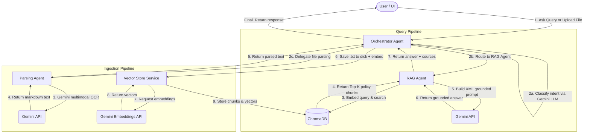

# Project 2 — Multi-Agent RAG Assistant (DY Patil University AI Workshop)

A production-grade Multi-Agent Retrieval-Augmented Generation (RAG) application built with **FastAPI**, **ChromaDB**, **Google GenAI SDK (`google-genai`)**, and an interactive **Web UI** supporting document uploads (.txt, .pdf, and image formats).

---

## 1. Overview & Teaching Objectives

This project demonstrates core AI Engineering and RAG patterns in a clean, modular codebase:

1. **SOLID & DRY Architecture**: Concerns separated into `config.py`, `genai_client.py`, `schemas/`, `prompts/`, `services/`, and `api/`. A shared GenAI client (`genai_client.py`) eliminates duplication across all agents.
2. **Multi-Agent Coordination**: An **Orchestrator Agent** receives every user query, classifies intent via Gemini LLM, and routes to either the **RAG Agent** (policy questions) or handles casual conversation directly.
3. **Multimodal Document Ingestion**: The **Parsing Agent** leverages `gemini-3.1-flash-lite` multimodal capabilities to extract layout-aware text from PDFs and images without any local parsing libraries.
4. **Vector Embeddings (Google API)**: Chunked paragraphs are converted into high-dimensional vectors using the `gemini-embedding-001` model.
5. **Vector Database (ChromaDB)**: A persistent local ChromaDB instance stores, queries, and ranks matching text chunks by cosine similarity.
6. **Grounded Answer Generation**: Retrieved document chunks are injected into structured XML prompt templates (strict grounding rules) to prevent hallucination.

---

## 2. Architecture & Data Flow

All queries pass through the **Orchestrator Agent** first. It classifies intent and routes accordingly:



---

## 3. Directory Structure

```
multi_agent_rag/
├── app/
│   ├── main.py                         # FastAPI app setup, lifespan, health check & static mount
│   ├── config.py                       # Centralized Pydantic BaseSettings (.env reader)
│   ├── genai_client.py                 # Shared, lazily-initialized Google GenAI client (DRY)
│   ├── prompts/
│   │   ├── __init__.py                 # Re-exports all prompt constants
│   │   ├── routing_prompt.py           # ROUTING_PROMPT — intent classification
│   │   ├── chat_prompt.py              # CHAT_PROMPT — casual conversation handler
│   │   └── rag_prompt.py               # PROMPT_TEMPLATE — XML grounded answer generation
│   ├── schemas/
│   │   └── rag.py                      # Pydantic schemas: AskRequest, AskResponse, IngestResponse, HealthResponse
│   ├── services/
│   │   ├── orchestrator_agent.py       # Central coordinator: classifies intent & routes to specialists
│   │   ├── parsing_agent.py            # Specialist: extracts text from PDF/image/txt via Gemini Vision
│   │   ├── rag_service.py              # Specialist: Retrieve → Augment → Generate pipeline
│   │   └── vector_store_service.py     # ChromaDB client, chunker, embedder & source query helper
│   └── api/
│       └── rag_router.py               # REST endpoints: /ask, /upload, /ingest, /sources
├── sample_docs/                        # Seed campus policy .txt files (persists uploaded docs too)
├── static/
│   ├── index.html                      # Web UI
│   ├── css/style.css                   # Styling
│   └── js/app.js                       # Client-side chat & upload manager
├── .env.example                        # Environment variable template
├── requirements.txt                    # Python dependencies
├── Dockerfile                          # Container build definition
└── DEPLOYMENT.md                       # GCP Cloud Run deployment guide
```

---

## 4. Quick Setup

### Step 1: Create & Activate Virtual Environment

```bash
cd "multi_agent_rag"

python3 -m venv venv
source venv/bin/activate        # On Windows: venv\Scripts\activate
```

### Step 2: Install Dependencies

```bash
pip install -r requirements.txt
```

### Step 3: Configure Environment

```bash
cp .env.example .env
```

Edit `.env`:
```env
GEMINI_API_KEY=your_google_ai_studio_api_key_here
GEMINI_MODEL=gemini-3.1-flash-lite
EMBEDDING_MODEL=gemini-embedding-001
CHROMA_PATH=./chroma_db
TOP_K=3
HOST=0.0.0.0
PORT=8001
```

---

## 5. Running the Application

```bash
python3 -m uvicorn app.main:app --reload --port 8001
```

| URL | Description |
|-----|-------------|
| [http://localhost:8001](http://localhost:8001) | Web UI |
| [http://localhost:8001/docs](http://localhost:8001/docs) | Swagger API Docs |
| [http://localhost:8001/health](http://localhost:8001/health) | Health Check |

---

## 6. Presenter Walkthrough

### Agent 1 — Orchestrator Agent (`app/services/orchestrator_agent.py`)
The single entry point for **all** user queries.
- Calls Gemini with the `ROUTING_PROMPT` from `app/prompts/routing_prompt.py` to classify the query as `RAG_AGENT` or `GENERAL_CONVERSATION`.
- If `RAG_AGENT` → delegates to the **RAG Service** for grounded policy lookup.
- If `GENERAL_CONVERSATION` → responds directly using the `CHAT_PROMPT`, guiding the student on available topics.
- Also handles file uploads — delegates parsing to the **Parsing Agent**, persists the parsed `.txt` to `sample_docs/`, and indexes it in ChromaDB.

### Agent 2 — Parsing Agent (`app/services/parsing_agent.py`)
Specialist for document ingestion.
- For `.txt` files: decodes directly without an LLM call.
- For PDFs and images: sends raw bytes to `gemini-3.1-flash-lite` multimodal API to extract structured markdown text (tables, headings, rules).

### Agent 3 — RAG Service (`app/services/rag_service.py`)
Specialist for grounded question answering.
- **Retrieve**: Embeds user question via `gemini-embedding-001`, queries ChromaDB for the nearest Top-K chunks.
- **Augment**: Injects retrieved chunks into the XML `PROMPT_TEMPLATE` from `app/prompts/rag_prompt.py`.
- **Generate**: Calls Gemini with the grounded prompt. Responds strictly from context — no hallucination.

### Shared Infrastructure

- **`app/genai_client.py`**: Single shared `genai.Client` instance used by all agents — created once, reused everywhere.
- **`app/services/vector_store_service.py`**: Manages ChromaDB — paragraph chunking, Gemini batch embeddings (`_embed()` helper), cosine similarity search, and dynamic source listing.

---

## 7. Live Demo Commands (`curl`)

### Ask a policy question
```bash
curl -X POST http://localhost:8001/api/rag/ask \
  -H "Content-Type: application/json" \
  -d '{"question": "What is the hostel curfew timing?", "top_k": 3}'
```

### Ask a casual question (Orchestrator routes to GENERAL_CONVERSATION)
```bash
curl -X POST http://localhost:8001/api/rag/ask \
  -H "Content-Type: application/json" \
  -d '{"question": "Hello, who are you?"}'
```

### Upload a new policy document (PDF, TXT, or Image)
```bash
curl -X POST http://localhost:8001/api/rag/upload \
  -F "file=@/path/to/policy.pdf"
```

### Rebuild vector index from disk
```bash
curl -X POST http://localhost:8001/api/rag/ingest
```

### List all indexed documents
```bash
curl http://localhost:8001/api/rag/sources
```

---

## 8. API Contract

| Method | Endpoint | Description |
| :--- | :--- | :--- |
| `POST` | `/api/rag/ask` | Entry point for all queries. Orchestrator classifies intent and routes. Accepts `{question, top_k}`. |
| `POST` | `/api/rag/upload` | Upload a document (TXT, PDF, PNG, JPG). Parsed by Parsing Agent, persisted to disk, indexed in ChromaDB. |
| `POST` | `/api/rag/ingest` | Force-rebuild the vector index from all `.txt` files in `sample_docs/`. |
| `GET` | `/api/rag/sources` | Returns all unique document source names currently indexed in ChromaDB. |
| `GET` | `/health` | Health check — returns server status, active model names, and total chunk count. |

---

## 9. Prompt Engineering & Customization Guide

You can easily fine-tune the system behavior, persona, and accuracy by modifying the python prompt files in `app/prompts/`. Below are guidelines and techniques to optimize these prompts:

### 1. Persona & Tone Adjustment
To alter how the assistant communicates (e.g., making it more formal, casual, or enthusiastic), edit the `<instructions>` tag in `chat_prompt.py` or `rag_prompt.py`.
* **Example (Formal Persona)**:
  ```python
  # app/prompts/chat_prompt.py
  CHAT_PROMPT = """<instructions>
  You are the Academic Affairs Advisor at DY Patil University. 
  Respond formally, address the user as "Student", and keep your answer concise.
  List the official topics you can assist with: hostel rules, library rules, fee schedules, admissions, and exam policies.
  </instructions>
  """
  ```

### 2. Few-Shot Prompting (Recommended for Routing)
For edge cases in intent classification, add concrete input-output examples directly inside `routing_prompt.py` before the user's query. This gives the model explicit context on what queries belong to which specialist.
* **Example**:
  ```python
  # app/prompts/routing_prompt.py
  ROUTING_PROMPT = """<instructions>
  You are the Orchestrator Agent...
  [Rules here]
  </instructions>

  <examples>
  User: Hi, how are you today?
  Class: GENERAL_CONVERSATION

  User: What is the fine if I return a library book late?
  Class: RAG_AGENT

  User: Can you tell me when the hostel gate closes?
  Class: RAG_AGENT
  </examples>

  <question>
  {question}
  </question>
  """
  ```

### 3. Chain of Thought (CoT) & Reasoning
To improve complex policy reasoning (e.g., computing library fines or verifying exam eligibility rules), instruct the model to think step-by-step before producing the final output. This is typically done by adding a `<thinking>` or `<scratchpad>` tag.
* **Example**:
  ```python
  # app/prompts/rag_prompt.py
  PROMPT_TEMPLATE = """<instructions>
  Answer the student's question based ONLY on the context blocks provided.
  Before answering, break down the student's request step-by-step inside a <thinking> block to verify constraints, then provide the final output inside an <answer> block.
  </instructions>

  <context>
  {context}
  </context>

  <question>
  {question}
  </question>
  """
  ```

### 4. Gemini Best Practices
* **Use XML Tags**: Gemini models are highly optimized to follow structure wrapped in XML tags (e.g., `<context>`, `<instructions>`, `<examples>`). Keep using them to separate logic from raw user variables.
* **Define Hallucination Handling**: Keep a strict fallback rule (like the one present in `rag_prompt.py`) so the model defaults to a specific message rather than generating plausible but incorrect answers.

---

## 10. Understanding Vector Search: HNSW vs. Cosine Distance

To perform fast and accurate similarity searches, this project utilizes **HNSW** (the navigation algorithm) and **Cosine Distance** (the measurement metric) in tandem:

### 1. Cosine Distance (The Compass / Metric)
* **What it does**: It is the mathematical formula used to calculate how similar two vectors are.
* **How it works**: It measures the angle (direction) between vectors rather than their straight-line distance ($L_2$). This is ideal for text matching because it focuses on topic alignment rather than document length.
* **Scores**: ChromaDB outputs Cosine Distance ($1 - \text{Similarity}$):
  * `0.0` = Perfect match (pointing in the exact same direction).
  * `1.0` = Unrelated (perpendicular).
  * `2.0` = Opposite directions.

### 2. HNSW (The Map / Navigation Index)
* **What it does**: It is the multi-layered graph data structure constructed to index our document chunks.
* **How it works**: Instead of comparing the user's query against every document one-by-one (brute force), HNSW traverses the graph from far-away expressway layers down to dense local streets to find nearest neighbors in milliseconds.

### How They Work Together
* **HNSW** acts as the explorer navigating the map of documents to locate closest matches.
* **Cosine Distance** is the compass HNSW checks at every node to answer the question: *"Which neighbor is closest to the query?"*
* HNSW uses Cosine measurements to guide its path, ultimately returning the top $K$ closest chunks.